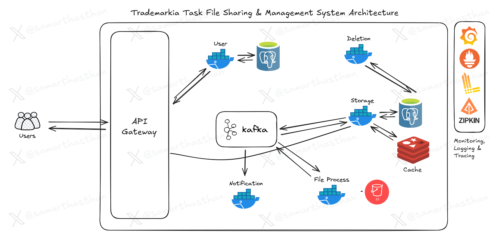
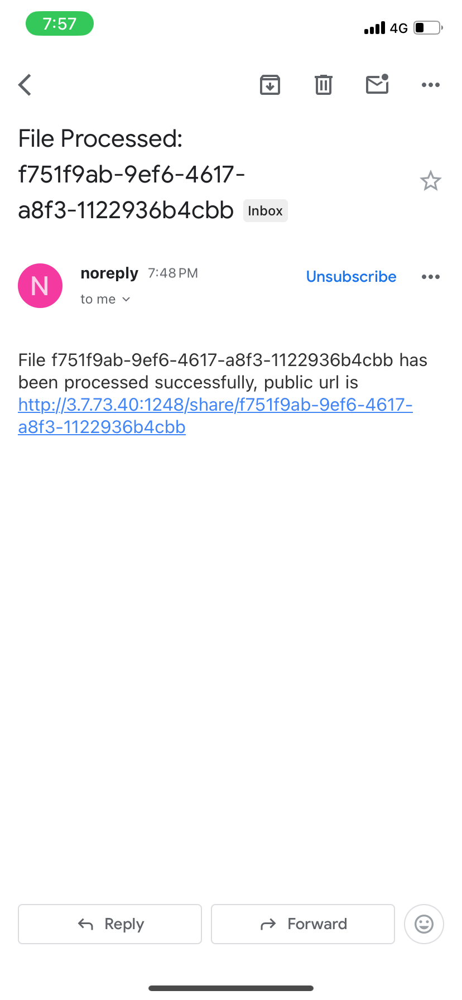

# File Sharing & Management System

```
Name - Samarth Asthan
Reg.No - 21BRS1248
Mail - samarthasthan27@gmail.com
```

**Note**: This project uses **MinIO S3**, a Golang-based open-source S3 object storage, for file storage. If you want to use any other S3-compatible storage, simply change the S3 credentials in the environment configuration.

## Project Overview

This project is a scalable and efficient File Sharing & Management System designed to support multiple users, file uploads, metadata storage, notifications, and optimized file search. It leverages event-driven architecture with technologies like **Kafka**, **gRPC**, **Go**, and more to ensure high performance and decoupled communication.

## Architecture Overview

The system includes an API Gateway for routing requests, **gRPC** for fast inter-service communication, and **Kafka** for event management. The files are stored in **S3**, metadata in **PostgreSQL**, and frequently accessed data is cached with **Redis**. Monitoring and logging are handled using **Grafana**, **Prometheus**, **Loki**, and **Zipkin** for distributed tracing.



## Key Technologies

- **Go**: Backend service development
- **gRPC**: Inter-service communication
- **Kafka**: Event-driven architecture
- **PostgreSQL**: Metadata storage
- **Redis**: Caching layer
- **S3**: File storage
- **Grafana, Prometheus, Loki, Zipkin**: Monitoring and tracing
- **Docker**: Containerization
  
## Notes on Current Implementation

Due to time constraints, some aspects of the project are not as polished as they could be:

- **Comments:** The code may lack comprehensive comments and documentation. This is an area for improvement to enhance readability and maintainability.
- **Testing:** Only a few tests are written in the `common` folder. More extensive testing is needed to ensure robustness and reliability.
- **Search Indexing:** Indexing for better search functionality has not been implemented. Adding this feature could significantly improve search performance and accuracy.
- **Hard-Coded Values:** Some values are hard-coded in the implementation. These should ideally be replaced with configurable options or environment variables for greater flexibility and maintainability.

These are areas that can be improved in future iterations to enhance the overall quality and functionality of the system.

## Live URL

You can access the live application using the following URL:

[http://3.111.198.193:1248](http://3.111.198.193:1248)

## Sample Screenshots

Here are some screenshots of the app:

| Upload File                                                           | Notification                           |
| --------------------------------------------------------------------- | -------------------------------------- |
|  |  |

| Public URL                                                           | Object Storage                                                           |
| -------------------------------------------------------------------- | ------------------------------------------------------------------------ |
|  |  |

| Files Endpoint                                                           |
| ------------------------------------------------------------------------ |
|  |

## API Endpoints

- **POST /user/login**: Login endpoint.
- **POST /user/register**: Register a new user.
- **POST /upload**: Upload a file (protected by JWT).
- **GET /files**: Fetch list of user files (protected by JWT).
- **GET /share/:file_id**: Get a shared file by ID.

## Core Components

1. **API Gateway**: Routes user requests and interacts with backend services.
2. **Kafka**: Manages asynchronous communication between components.
3. **Storage Service**: Uploads files to **S3** and stores metadata in **PostgreSQL**.
4. **Metadata & Search**: Stores metadata in **PostgreSQL**.
5. **Redis**: Caches frequently accessed file metadata for performance.
6. **File Processing**: Processes files storing them in **S3**.
7. **Notification Service**: Sends user mail notifications based on events (file processed).
8. **Monitoring & Logging**: **Grafana**, **Prometheus**, **Loki**, and **Zipkin** handle system reliability and performance tracking.

## System Flow

1. Users upload files via the **API Gateway**.
2. Files are processed and stored in **S3**, with metadata stored in **PostgreSQL**.
3. Metadata is indexed in **Elasticsearch** for quick search functionality.
4. **Kafka** manages event communication between services (file uploads, deletions).
5. **Redis** caches metadata to reduce load on the database.
6. Notifications are triggered based on **Kafka** events.
7. Monitoring is done via **Grafana**, **Prometheus**, **Loki**, and **Zipkin**.

## How to Run the Project

To run the project in development mode:

```bash
make up
```

To bring down the development environment:

```bash
make down
```

## Database Migrations

To apply migrations:

```bash
make migrate-up
```

To rollback migrations:

```bash
make migrate-down
```

## SQLC Code Generation

To generate SQL code for database operations:

```bash
make sqlc-gen
```

## gRPC Code Generation

To generate Go code from Protocol Buffers:

```bash
make grpc-gen
```

To clean generated Go code:

```bash
make grpc-clean
```

## Requirements

You need the following tools installed:

- **SQLC** for SQL code generation
- **Migrate** for managing database migrations
- **Docker** for containerization

## Sample `.env` File

```bash
API_PORT=1248

# User service
USER_GRPC_PORT=9000
USER_GRPC_HOST=user
USER_DB_PORT=5432
USER_POSTGRES_USER=root
USER_POSTGRES_PASSWORD=password
USER_POSTGRES_DB=postgres
USER_POSTGRES_HOST=postgres

# Storage service
STORAGE_GRPC_PORT=9001
STORAGE_GRPC_HOST=storage
STORAGE_DB_PORT=5432
STORAGE_POSTGRES_USER=root
STORAGE_POSTGRES_PASSWORD=password
STORAGE_POSTGRES_DB=postgres
STORAGE_POSTGRES_HOST=postgres

# Redis
REDIS_PORT=6379
REDIS_HOST=redis

# Monitoring and Tracing
GRAFANA_PORT=16000
GRAFANA_LOKI_HOST=loki
GRAFANA_LOKI_PORT=4100
PROMETHEUS_PORT=16002
ZIPKIN_HOST=zipkin
ZIPKIN_PORT=10411

# MinIO (for file storage)
MINIO_PORT=13000
MINIO_WEB_PORT=13001
MINIO_ROOT_USER=root
MINIO_ROOT_PASSWORD=password
MINIO_HOST=minio
MINIO_DEFAULT_BUCKETS=uploads

# File size limit (500MB)
MAX_FILE_SIZE=5000*1024*1024

# Kafka
KAFKA_PORT=29092
KAFKA_EXTERNAL_PORT=9092
KAFKA_HOST=kafka

# SMTP (for notifications)
SMTP_SERVER=smtp-relay.brevo.com
SMTP_PORT=587
SMTP_LOGIN=
SMTP_PASSWORD=

HOST=http://localhost:1248
```

````md
## API Endpoints

Here's how you can interact with the APIs for the File Sharing & Management System:

### User Registration

Register a new user:

```bash
curl --location 'http://localhost:1248/user/register' \
--data-raw '{
    "first_name": "Samarth",
    "last_name": "Asthan",
    "email": "samarthasthan27@gmail.com",
    "password": "password"
}'
```
````

### User Login

Log in with an existing user:

```bash
curl --location 'http://localhost:1248/user/login' \
--header 'Content-Type: application/json' \
--data-raw '{
    "email": "samarthasthan27@gmail.com",
    "password": "password"
}'
```

### File Upload

Upload a file (requires authentication):

```bash
curl --location 'http://localhost:1248/upload' \
--header 'Authorization: Bearer <your-jwt-token>' \
--form 'file=@"<path-to-your-file>"'
```

Replace `<your-jwt-token>` with the JWT token received from the login API, and `<path-to-your-file>` with the path to the file you want to upload.

### List Files

Retrieve a list of uploaded files (requires authentication):

```bash
curl --location 'http://localhost:1248/files' \
--header 'Authorization: Bearer <your-jwt-token>'
```

Replace `<your-jwt-token>` with the JWT token received from the login API.

````

## Project Directory Structure

```bash
├── Makefile
├── README.md
├── api
│   ├── cmd
│   │   └── main.go
│   └── internal
│       └── handler
│           ├── handler.go
│           ├── storage.go
│           └── user.go
├── assets
│   └── trademarkia_architecture.png
├── build
│   ├── compose
│   │   └── compose.yaml
│   └── dockerfile
│       ├── api
│       │   └── Dockerfile
│       ├── delete
│       │   └── Dockerfile
│       ├── file-process
│       │   └── Dockerfile
│       ├── kafka
│       │   └── Dockerfile
│       ├── notification
│       │   └── Dockerfile
│       ├── storage
│       │   └── Dockerfile
│       └── user
│           └── Dockerfile
├── common
│   ├── bcrypt
│   │   ├── password.go
│   │   └── password_test.go
│   ├── env
│   │   ├── env.go
│   │   └── env_test.go
│   ├── grpc
│   │   ├── client.go
│   │   └── server.go
│   ├── kafka
│   │   ├── consumer.go
│   │   └── producer.go
│   ├── logger
│   │   └── logger.go
│   ├── models
│   │   ├── file_process.go
│   │   └── mail.go
│   ├── proto
│   │   ├── storage.proto
│   │   └── user.proto
│   ├── proto_go
│   │   ├── storage.pb.go
│   │   ├── storage_grpc.pb.go
│   │   ├── user.pb.go
│   │   └── user_grpc.pb.go
│   └── zipkin
│       └── tracer.go
├── config
│   ├── grafana
│   │   ├── dashboards
│   │   │   ├── dashboard.json
│   │   │   └── dashboard.yml
│   │   └── datasources
│   │       └── datasource.yaml
│   └── prometheus
│       └── prometheus.yaml
├── services
│   ├── delete
│   ├── file-process
│   ├── notification
│   ├── storage
│   └── user
└── go.mod
````
